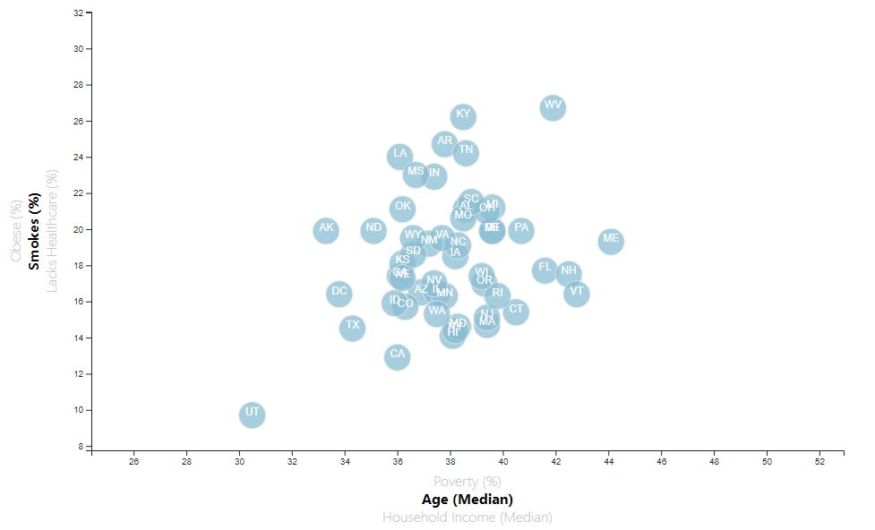
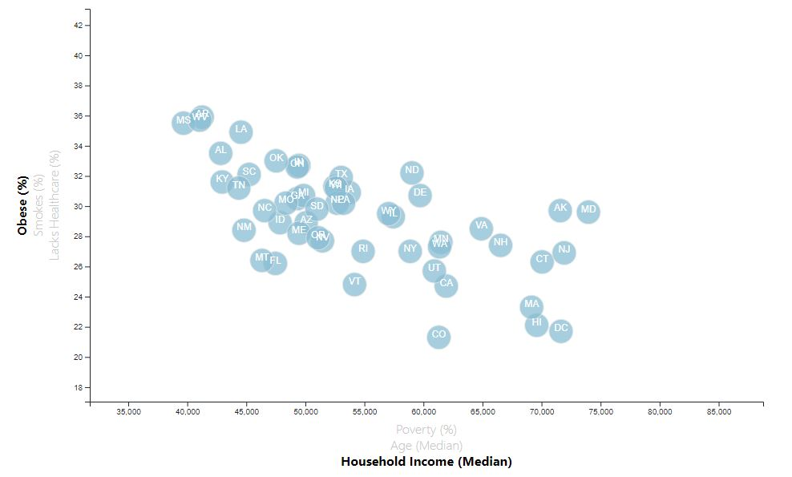

# D3 Homework - Data Journalism and D3

https://jennysueee.github.io/D3-challenge/

Completed level 1 and 2 of Homework assignment

### Correlations Discovered Between Health Risks and Age, Income

Based on 2014 U.S. Census Bureau data, there is a positive correlation between poverty and obesity, smoking, and lacking healthcare. The states with higher percentages of those in poverty also have higher percentages of obesity, smokers, and those lacking healthcare. As a mirror to this finding, there is a negative correlation between household income and the same factors. So the lower income you have, the higher likelihood you are to experience these same health risks. Though not as strong of a correlation, there is a subtle trend by age and healthcare; the older you are the more likely you are to have healthcare, and the younger you are the more likely you are not a smoker. 
